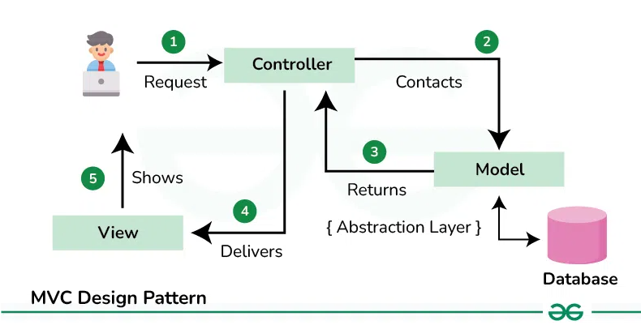
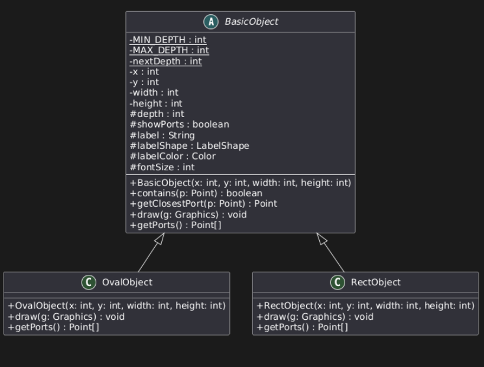
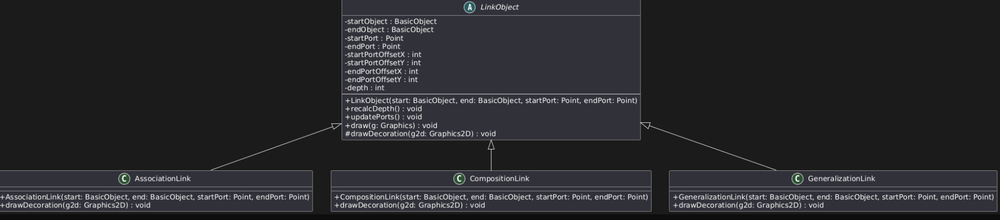

## 架構
- 採用MVC(model view controller)將數據、視圖和控制邏輯分離
  - Model: 負責數據和邏輯
    - 管理所有與圖形和連線相關的資料和邏輯，像是每個物件的屬性（座標、尺寸、深度、連接埠、標籤等）以及群組、連線等運算。
  - View: 負責畫面的顯示
    - 負責繪製並顯示畫面上的所有圖形、連線以及 UI 元件，讓使用者看到目前的狀態。
  - Controller: 使用者的互動
    - 負責捕捉和處理使用者的操作（例如滑鼠點擊、拖曳、按鈕點選等），並根據這些輸入更新 Model 的狀態，再通知 View 重繪。

## UML 設計

## 參考
Google Java Style Guide
> https://google.github.io/styleguide/javaguide.html
