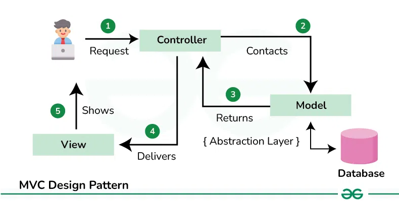

## 架構
- 採用MVC(model view controller)將數據、視圖和控制邏輯分離
  - Model: 負責數據和邏輯
    - 管理所有與圖形和連線相關的資料和邏輯，像是每個物件的屬性（座標、尺寸、深度、連接埠、標籤等）以及群組、連線等運算。
  - View: 負責畫面的顯示
    - 負責繪製並顯示畫面上的所有圖形、連線以及 UI 元件，讓使用者看到目前的狀態。
  - Controller: 使用者的互動
    - 負責捕捉和處理使用者的操作（例如滑鼠點擊、拖曳、按鈕點選等），並根據這些輸入更新 Model 的狀態，再通知 View 重繪。

## Requirement and Spec
以下只有大略列出Requirement詳細內容請參考spec

UseCase A. Creating an object
- precondition: 適用 rect 或 oval 按鈕被按下的情況

UseCase B. Creating a Link
- precondition: 適用 association, generalization 以及 composition 三個按鈕。

UseCase C. Select / Unselect a single objects
- definition: 當一個基本物件被處於被 select 的狀態,我們會將所有 connection
  ports 明確顯示出來,如上圖,以表示基本物件處於被 select 的狀 態。相反的
  若基本物件處於不被 select 的狀態,則 connection ports 是隱藏的。 
- 這邊我參考draw.io的部分，當使用line時 hover會顯示port以增加user experience。

## 參考
Google Java Style Guide
> https://google.github.io/styleguide/javaguide.html
